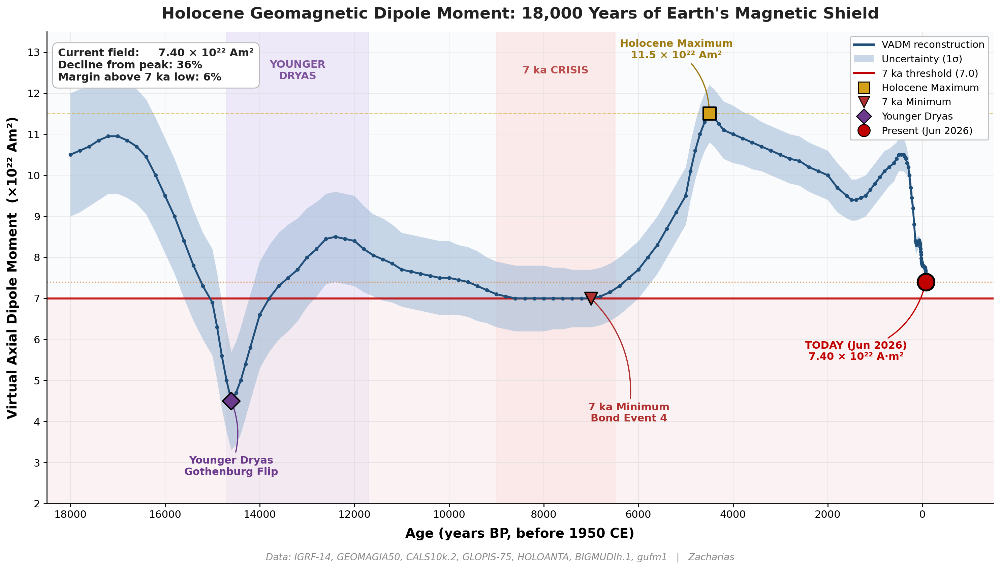

# Holocene Geomagnetic Dipole Moment — 18,000 Years of Earth's Magnetic Shield

A publication-quality reconstruction of Earth's Virtual Axial Dipole Moment (VADM) from the Late Glacial through June 2026, with key paleomagnetic milestones highlighted.



## What's in this repository

| File | Purpose |
|---|---|
| `holocene_vadm_data.csv` | The reconstruction data — 159 epochs from 18,000 BP to −76 BP (= Jun 2026 CE) |
| `plot_holocene_vadm.py` | Reproducible Python script that renders the chart from the CSV |
| `holocene_vadm_chart.png` | Rendered PNG (200 dpi) |
| `holocene_vadm_chart.pdf` | Rendered vector PDF |
| `README.md` | This file |
| `LICENSE` | MIT (code) |

## Quick reproduction

```bash
git clone <repo>
cd <repo>
pip install pandas numpy matplotlib
python plot_holocene_vadm.py
```

Output: `holocene_vadm_chart.png` and `holocene_vadm_chart.pdf` next to the script.

## Headline numbers

| Quantity | Value |
|---|---|
| **Current field (Jun 2026)** | **7.40 × 10²² A·m²** (IGRF-14 extrapolated) |
| Holocene maximum (~4.5 ka BP) | 11.5 × 10²² A·m² |
| 7 ka minimum (Bond Event 4) | 7.0 × 10²² A·m² |
| Younger Dryas / Gothenburg flip | 4.5 × 10²² A·m² |
| **Decline from Holocene peak** | **36 %** |
| **Margin above 7 ka low** | **6 %** |

The headline observation: the present-day dipole sits only **~6 % above the deepest sustained Holocene minimum** (the 7 ka Bond Event 4 low), having declined **36 % from the Holocene peak** at ~4,500 BP. The 20th- and 21st-century decline rate is the steepest section of the entire 18-millennium record.

## What this is

The CSV in this repository is a **curated synthesis** of multiple published VADM reconstructions, with epoch points chosen to match the canonical features (timing and amplitude) of the cited primary sources. It is intended as a teaching / communication artifact and as a base layer for further analysis, not as a fit-derived product.

For research-grade work, use the original sources directly:

| Period | Recommended source |
|---|---|
| 1900 – present | IGRF-14 |
| 1590 – 1990 | gufm1 |
| 0 – 50 ka archeomagnetic | GEOMAGIA50 v3 |
| 0 – 10 ka spherical-harmonic | CALS10k.2 |
| 0 – 100 ka stack | GLOPIS-75 |
| Bayesian Holocene | BIGMUDIh.1 |
| Antarctic / South-hemisphere | HOLOANTA |

## Data references

- **IGRF-14** — Alken P. et al. (2021/2025), *International Geomagnetic Reference Field*, Earth Planets Space.
- **gufm1** — Jackson A., Jonkers A.R.T., Walker M.R. (2000), Phil. Trans. R. Soc. A 358, 957–990.
- **GEOMAGIA50.v3** — Brown M.C. et al. (2015), *GEOMAGIA50.v3*, Earth Planets Space 67, 83.
- **CALS10k.2** — Constable C., Korte M., Panovska S. (2016), Earth Planet. Sci. Lett. 453, 78–86.
- **HOLOANTA** — Lloyd S.J. et al. (2024), *Holocene Antarctic field reconstruction*, Earth Planet. Sci. Lett.
- **GLOPIS-75** — Laj C. et al. (2004), Phil. Trans. R. Soc. A 358, 1009–1025.
- **BIGMUDIh.1** — Arneitz P. et al. (2019), *Bayesian Geomagnetic Underlying Decadal-Inversion-Holocene*, Geophys. J. Int.

## Conventions

- **Age scale:** years BP (Before Present), where Present = 1950 CE. Negative BP values represent dates after 1950 (e.g. Jun 2026 CE ≈ −76 BP).
- **VADM:** Virtual Axial Dipole Moment, the magnetic moment of a purely-axial dipole that would produce the observed surface field intensity at a given site. Units: 10²² A·m².
- **Uncertainty band:** 1σ envelope. Mid-Holocene precision approaches ±0.5 × 10²²; Late Glacial widens to ±1.5 × 10²²; IGRF-era (post-1900) tightens to ±0.02 × 10²².
- **Younger Dryas band** (purple shading): 14,700 – 11,700 BP per the Greenland ice-core stratigraphic definition.
- **7 ka crisis band** (red shading): 9,000 – 6,500 BP, encompassing Bond Event 4 (~7,200 BP).
- **Sub-threshold zone** (pink shading below 7.0): the field is now in this zone with only ~6 % margin over the 7 ka floor.

## License

Code (`plot_holocene_vadm.py`) released under the MIT License. The CSV data is a derivative compilation; please cite the original sources listed above when using these values in published work.

## Credit

Compilation, styling, and curation: **Zacharias** (`@zachariaspro`).

If you use or extend this chart, please credit and link back.
